# T-Swift
T-Swift es un interprete de lenguaje de programación funcional, basado en el paradigma de tipado estático, que permite la ejecución de programas en un entorno de consola.

## Características

- Tipado estático
- Tipos de datos primitivos: `int`, `float`, `bool`, `string`
- Tipos de datos compuestos: `vector`, `matrix`
- Funciones recursivas
- Ciclos: `while`, `for`
- Condicionales: `if`, `if-else`, `switch`
- Funciones: `void`, `int`, `float`, `bool`, `string`
- Función de impresión: `print`
- Comentarios de una línea: `//`
- Casteo de tipos de datos
- Funciones nativas `print`, `append`, `remove`, `removeAt`, `Int`, `Float`, `String`
- Comentarios de múltiples líneas: `/* */`
- Manejo de errores
- Tabla de símbolos
- Gráfica de árbol de ejecución
- Reporte de errores

## Instalación

```bash
git clone
cd T-Swift
pnpm install
```

### Requisitos

- Node.js >= 14.0.0
- Pnpm >= 6.0.0

## Ejecución

```bash
$ pnpm start
```

## Ejemplos

```swift
// Bienvenido a T-Swift
let hola = "Hola"
let mundo = "Mundo"
let palabra = hola + " " + mundo
print(palabra)

```

## Lenguaje

### Declaración de variables

```swift
// Declaración de variables
  var a = 1;
  var b = 1.0;
  var c = true;
  var d = "hola";
```

### Declaración de vectores

```swift
// Declaración de arreglos
  var arreglo1 = [1, 2, 3];
  var arreglo2 = [1.0, 2.0, 3.0];
  var arreglo3 = [true, false, true];
  var arreglo4 = ["hola", "mundo"];
```

### Declaración de matrices

```swift
// Declaración de matrices
  var matriz1 = [[1, 2, 3], [4, 5, 6], [7, 8, 9]];
  var matriz2 = [[1.0, 2.0, 3.0], [4.0, 5.0, 6.0], [7.0, 8.0, 9.0]];
  var matriz3 = [[true, false, true], [false, true, false], [true, false, true]];
  var matriz4 = [["hola", "mundo"], ["mundo", "hola"]];
```

### Declaración de funciones

```swift
// Declaración de funciones

// Nombres externos e internos iguales

func suma(a: int, b: int) -> int {
    return a + b;
}

// Nombres externos e internos diferentes

func resta(a num1: int, b num2: int) -> int {
    return num1 - num2;
}

// Por puntero

func multiplicacion(a: Int Inout, b: Int Inout){
    a = a * b;
}

// Sin nombres externos 

func division(_ a: int, _ b: int) -> int {
    return a / b;
}

```


### Declaración de condicionales

```swift
// Declaración de condicionales
 
     var a: Int = 1;
      if(a == 1){
          print("a es igual a 1");
      }else{
          print("a es diferente a 1");
      }
  
```

### Declaración de ciclos

```swift
// Declaración de ciclos
  
        var a: Int = 1;
      while(a < 10){
          print(a);
          a = a + 1;
      }
  
```

### Declaración de funciones recursivas

```swift
// Declaración de funciones recursivas
 func ackermann(_ m: Int, _ n: Int) -> Int {
    if m == 0 {
        return n + 1
    } else if n == 0 {
        return ackermann(m - 1, 1)
    } else {
        return ackermann(m - 1, ackermann(m, n - 1))
    }
}

  
```

### Declaración de funciones nativas

```swift
// Declaración de funciones nativas
  let num1 = Int("20")
  let num2 = Int("20")
  let suma = String(num1 + num2)
  let num3 = Float("9.5")
  let num4 = Float("3.6")
  let resta = String(num3 - num4)
  let cadena = String(true) + "->" + String(3.504)
```

### Declaración de comentarios

```swift
// Declaración de comentarios
// Comentario de una línea
/* Comentario de
  múltiples líneas */
```

### Declaración de switch

```swift
// Declaración de switch
  
var a: Int = 1;
switch(a){
    case 1:
        print("a es igual a 1");
        break;
    case 2:
        print("a es igual a 2");
        break;
    default:
        print("a es diferente a 1 y 2");
        break;
}
  
```


### Declaración de for

```swift
// Declaración de for
for i in 0...9 {
    var output = ""
    for _ in 0...(10 - i) {
        output = output + " "
    }
    for _ in 0...i {
        output = output + "* "
    }
    print(output)
}
```

### Declaración de un struct

```swift
// Declaración de un struct
struct Transporte {
    var pasajeros = 0
    var velocidad = 100
    var nombre: String
    var piloto: Persona
    mutating func frenar(){
        self.velocidad = 0
    }
    mutating func acelerar(){
        self.velocidad += 50 
    }
    func mostrarVelocidad(){
        print("Velocidad: ", self.velocidad)
    }
    func mostrarPasajeros(){
        print("Pasajeros: ", self.pasajeros)
    }
}
```

## Interfaz de usuario

Se contará con un editor de codigo, en el cual se podrá escribir el código a ejecutar, y un panel de consola, en el cual se mostrarán los resultados de la ejecución.

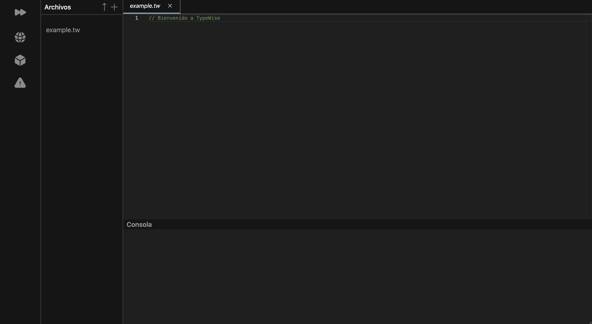

En el panel de salida, únicamente se mostrarán los resultados cuando se utiliza la función `print`, en caso de que el programa no contenga dicha función, no se mostrará nada en el panel de salida.
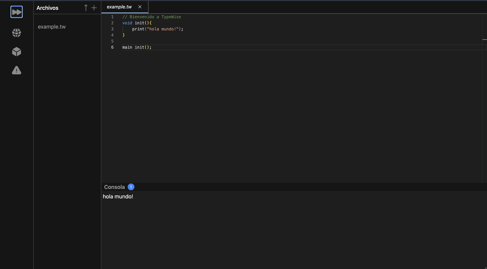

Se contará con un panel lateral donde se podrán seleccionar las siguientes opciones:

- Ejecutar
- Ver tabla de símbolos
- Ver gráfica de árbol de ejecución
- Ver reporte de errores

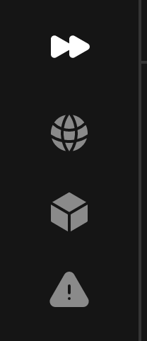

En la tabla de símbolos se mostrarán los identificadores declarados en el programa, junto con su tipo de dato y su valor.

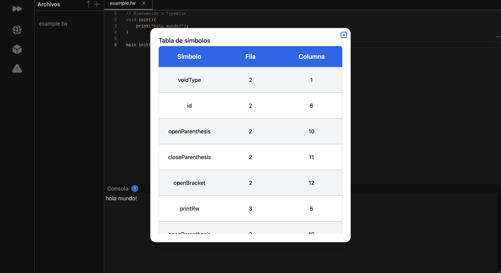

En la gráfica de árbol de ejecución se mostrará el árbol de ejecución del programa, en el cual se mostrarán los nodos que se van ejecutando.
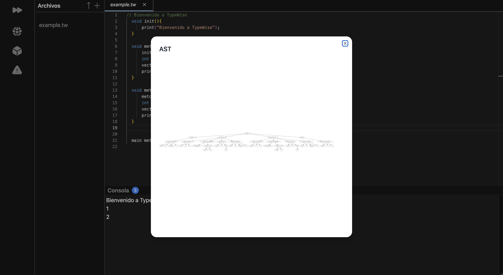

En el reporte de errores se mostrarán los errores que se hayan encontrado durante la ejecución del programa.
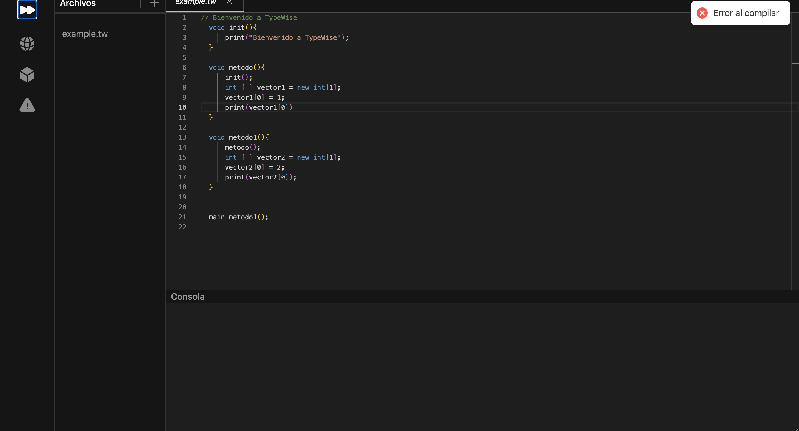
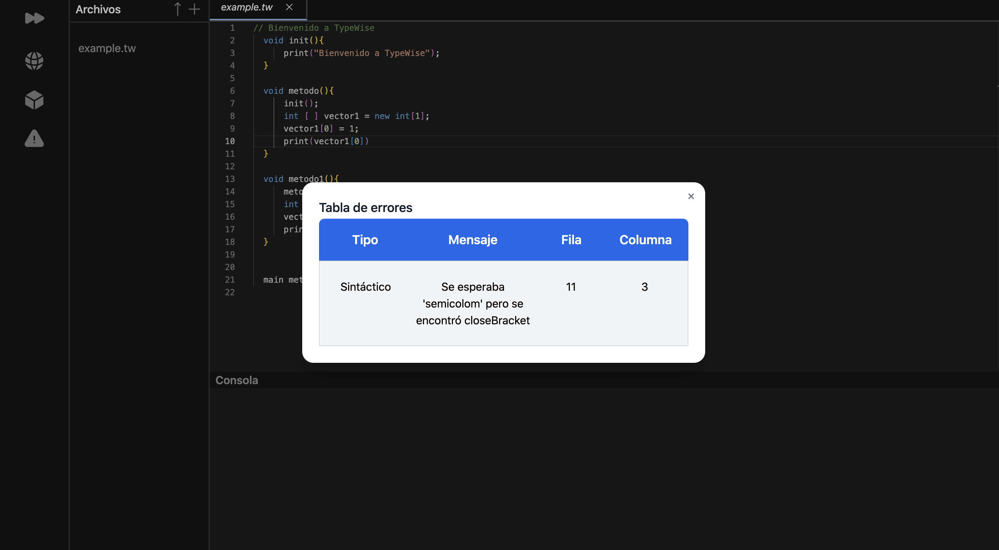

Se podrán cargar archivos de texto con extensión `.tw`, los cuales contienen el código a ejecutar. También se podrán crear desde el propio editor de código.
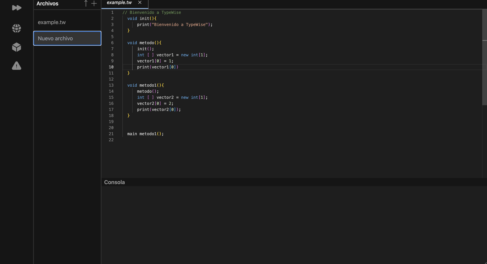
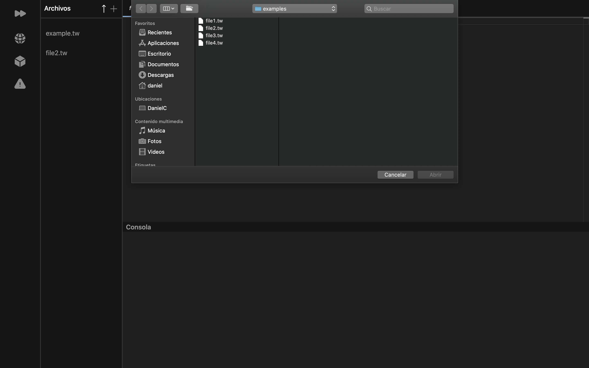

Estos archivos se mostrarán en la lista de archivos al lado izquierdo de la interfaz.
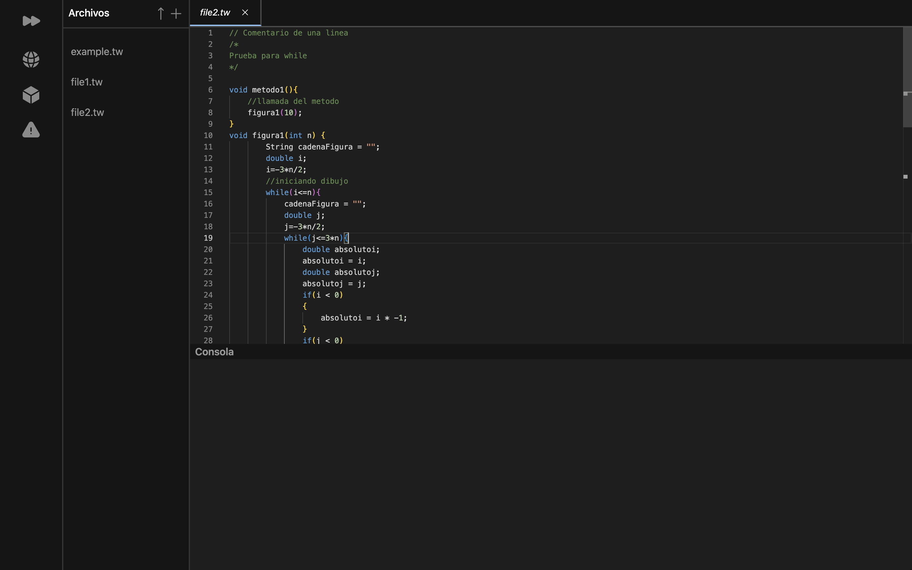

También se podrán cerrar los archivos abiertos.
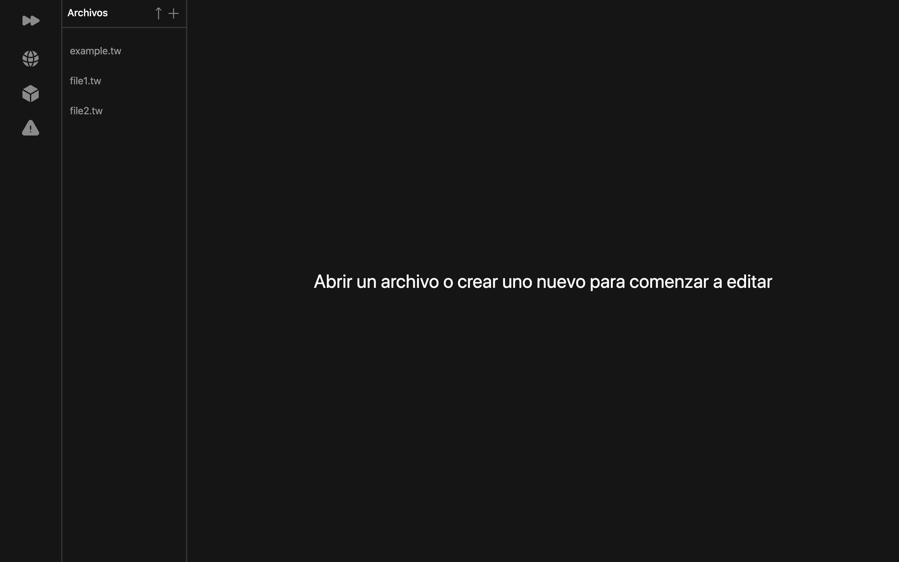
